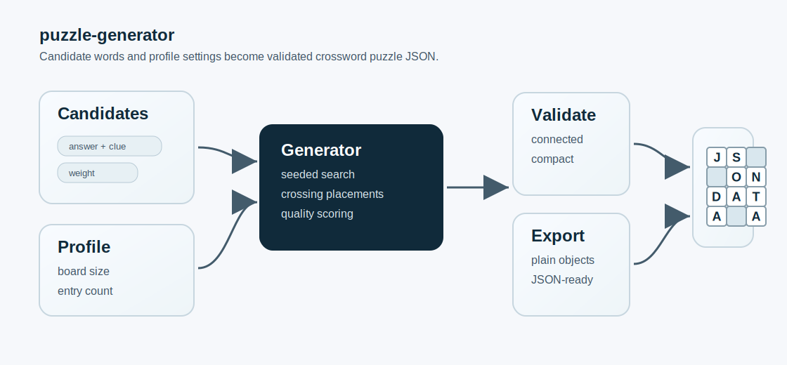

# puzzle-generator

A source-available crossword puzzle generator resource published by Liulifu.

It turns a list of answer-and-clue candidates into compact crossword-style puzzle data. The generator is deterministic by seed, validates generated boards, scores layout quality, and can export plain JSON datasets for apps, games, or learning tools.



## Install

```bash
bun install
```

The source exports TypeScript directly from `src/index.ts`. In a local project, import from the package root after cloning or vendoring the repository:

```ts
import {
  createCrosswordProfile,
  exportCrosswordDataset,
  generateCrosswordPuzzles,
  type CrosswordCandidate
} from "puzzle-generator";
```

## Quick Start

Create a candidate pool, choose a puzzle profile, then generate one or more puzzles.

```ts
import {
  createCrosswordProfile,
  exportCrosswordDataset,
  generateCrosswordPuzzles,
  type CrosswordCandidate
} from "./src";

const candidates: CrosswordCandidate[] = [
  { id: "meeting", answer: "MEETING", clue: "A planned discussion with people." },
  { id: "email", answer: "EMAIL", clue: "A written message sent online." },
  { id: "agenda", answer: "AGENDA", clue: "A list of planned topics." },
  { id: "report", answer: "REPORT", clue: "A document that summarizes information." },
  { id: "invoice", answer: "INVOICE", clue: "A bill requesting payment." },
  { id: "client", answer: "CLIENT", clue: "A customer receiving professional services." },
  { id: "budget", answer: "BUDGET", clue: "A plan for spending money." },
  { id: "task", answer: "TASK", clue: "A piece of work to complete." },
  { id: "review", answer: "REVIEW", clue: "A careful check or assessment." },
  { id: "vendor", answer: "VENDOR", clue: "A company that provides goods or services." }
];

const profile = createCrosswordProfile({
  id: "mini",
  targetEntryCount: 8,
  maxWidth: 12,
  maxHeight: 12,
  minCrossingCount: 4,
  minCheckedRatio: 0.12,
  beamWidth: 32,
  maxAttempts: 80
});

const result = generateCrosswordPuzzles({
  candidates,
  profile,
  seed: 20260623,
  limit: 3
});

const dataset = exportCrosswordDataset({
  profileId: profile.id,
  puzzles: result.puzzles
});

console.log(JSON.stringify(dataset, null, 2));
```

## Candidate Input

Each candidate represents one possible crossword entry:

```ts
type CrosswordCandidate = {
  id: string;
  answer: string;
  clue: string;
  difficulty?: number;
  tags?: readonly string[];
  weight?: number;
  metadata?: Record<string, unknown>;
};
```

Use uppercase or lowercase answers freely. The generator normalizes answers to A-Z letters and drops punctuation, spaces, and symbols. Candidates with duplicate normalized answers are ignored after the first occurrence.

Useful candidate fields:

- `id`: stable identifier used in generated entry ids.
- `answer`: the answer placed onto the board.
- `clue`: clue displayed to the solver.
- `weight`: higher values make a candidate more likely to be selected.
- `metadata`: optional app-specific data that can stay with your own source pool.

## Profile Tuning

Profiles control the size and difficulty of the generated board.

```ts
const profile = createCrosswordProfile({
  id: "classic",
  targetEntryCount: 20,
  maxWidth: 15,
  maxHeight: 15,
  minCrossingCount: 12,
  minCheckedRatio: 0.16,
  beamWidth: 64,
  maxAttempts: 120,
  placementLimitPerCandidate: 20,
  prefill: {
    maxAmbiguousMatches: 1,
    maxLettersPerEntry: 3
  }
});
```

Common settings:

- `targetEntryCount`: number of words the puzzle should contain.
- `maxWidth` and `maxHeight`: board bounds after normalization.
- `minCrossingCount`: minimum total checked intersections.
- `minCheckedRatio`: minimum ratio of checked letters.
- `beamWidth`: search breadth. Higher values can improve quality but cost more CPU.
- `maxAttempts`: number of seeded attempts before giving up.
- `placementLimitPerCandidate`: candidate placement breadth during search.
- `prefill`: controls hint letters that can reduce ambiguity in same-length answers.

## Output Shape

`generateCrosswordPuzzles` returns:

```ts
type CrosswordGenerationResult = {
  puzzles: CrosswordPuzzle[];
  rejectedCount: number;
  seed: number;
};
```

Each puzzle includes:

- `entries`: clue, answer, direction, number, start position, and occupied cells.
- `cells`: normalized board cells with solution letters and entry ids.
- `prefilledCells`: optional helper letters selected by the prefill policy.
- `validation`: whether the puzzle passed structural checks.
- `quality`: score breakdown for crossings, compactness, prefill, and validation.

## Validation

Generated puzzles are checked before they are returned. Validation can reject:

- disconnected entries
- duplicate answers
- clues that leak their answers
- entries outside board dimensions
- accidental across/down fragments
- insufficient crossings or checked-letter ratio
- ambiguous prefill patterns

If the candidate pool is too small or cannot form a valid board, the generator returns an empty `puzzles` array and a positive `rejectedCount`.

## Exporting JSON

Use `exportCrosswordDataset` when you want a stable plain-object payload:

```ts
const dataset = exportCrosswordDataset({
  profileId: "mini",
  generatedAt: "2026-06-23T00:00:00.000Z",
  puzzles: result.puzzles
});
```

The exported dataset is safe to pass to `JSON.stringify`.

## Development

```bash
bun install
bun test
bun run typecheck
```

Tests cover deterministic generation, larger classic profiles, validation, scoring-adjacent output, prefilled letters, and dataset export.

## License

This resource is available for noncommercial use under the PolyForm Noncommercial License 1.0.0. Commercial use requires separate written permission or a separate commercial license from Liulifu.

See `LICENSE.md` and `NOTICE` for the required notice and license terms.
